# AI Automation Money Paths

Recorded on: 2026-06-11

## Core View

The safest AI-driven monetization path is not full automation of prospecting, collection, and delivery. The better path is:

AI detects signals, drafts work, organizes evidence, and reduces missed follow-up. Humans approve commitments, outbound messages, pricing, live payment setup, customer relationships, and compliance decisions.

Local Growth OS implements this principle through two product paths:

- BidFlow Local: convert missed quote follow-up into paid pilots, proposals, and customer action.
- ReputeLoop: convert review risk and customer dissatisfaction into compliant responses, recovery workflows, and renewal evidence.

## Trend Basis

Recent sources show small-business AI adoption moving from experimentation into practical workflows:

- U.S. Chamber's 2025 small-business technology report shows continued growth in generative AI usage for efficiency, marketing, communication, and operations.
- Salesforce SMB AI trend reporting links AI adoption with revenue, marketing productivity, and customer-service improvement.
- Microsoft Work Trend Index 2025 frames the shift as human-agent collaboration, while still requiring clear human accountability.
- BrightLocal's 2026 local consumer review research shows consumers rely heavily on recent reviews, business responses, and AI-generated summaries when choosing local businesses.
- FTC fake review rules, CAN-SPAM, and FCC/TCPA texting rules show that review, email, and SMS automation must respect authenticity, opt-out, consent, and disclosure requirements.

References:

- https://www.uschamber.com/technology/empowering-small-business-the-impact-of-technology-on-u-s-small-business
- https://www.salesforce.com/news/stories/smbs-ai-trends-2025/
- https://www.microsoft.com/en-us/worklab/work-trend-index/2025
- https://www.brightlocal.com/research/local-consumer-review-survey/
- https://www.ftc.gov/business-guidance/resources/can-spam-act-compliance-guide-business
- https://www.federalregister.gov/documents/2024/08/22/2024-18519/trade-regulation-rule-on-the-use-of-consumer-reviews-and-testimonials
- https://www.fcc.gov/document/fcc-adopts-rules-protect-consumers-unwanted-robocalls-robotexts

## Path One: BidFlow Local

### Commercial Principle

Local service businesses often lose revenue because they respond slowly, fail to follow up after quotes, send unclear proposals, or forget warm opportunities. BidFlow structures those revenue leaks into an operator-reviewed workflow.

Revenue model:

1. Target higher-ticket service businesses with quote volume.
2. Charge a setup fee for import, diagnosis, and first-pack delivery.
3. Charge a monthly fee for scoring, quote packs, follow-up queues, and outcome evidence.
4. Prove ROI with one revived quote or won job.

### Technical Route

- Prospect CSV import for target businesses.
- Fit scoring by industry, reviews, average job value, and quote-leak signal.
- Sales outreach pack with manual email, call opener, and scope draft.
- Sales activity ledger for real touches and next steps.
- Checkout handoff after `scope_sent`.
- Paid Pilot Order Form with frozen scope, price, and payment entry.
- Stripe webhook evidence only after `payment_status=paid`.
- Customer material intake through onboarding.
- Estimate/proposal generation for first-pack delivery.
- Delivery evidence with QA, sent status, and customer confirmation.
- Outcome ledger for won jobs, revived quotes, and time saved.

### Human Review Boundaries

- Final quote must be reviewed by a human.
- Proposal scope, exclusions, warranty, and terms must be reviewed.
- First outbound emails and texts must be reviewed and consent-aware.
- Revenue is recognized only from Stripe paid ledger evidence and customer confirmation, not pipeline estimates.

## Path Two: ReputeLoop

### Commercial Principle

Local reviews influence search conversion, consumer trust, and AI recommendation summaries. Many businesses do not need fake review automation; they need timely, compliant, non-template responses and recovery workflows for dissatisfied customers.

Revenue model:

1. Target businesses with 30+ reviews, 4.0-4.6 ratings, and recent unanswered negative reviews.
2. Charge a setup fee for review import, risk triage, and first response drafts.
3. Charge monthly for monitoring, reply drafts, recovery offers, and outcome evidence.
4. Use approved replies, recovered customers, repeat bookings, or improved conversion evidence for renewal.

### Technical Route

- Review CSV or Google Business Profile import.
- Risk scoring for negative reviews, refund/legal/safety/service issues.
- Response pack with public-safe reply draft and compliance notes.
- Feedback case and recovery offer generation.
- Recovery link for approve, revision, callback, or decline.
- Checkout handoff and order form for paid pilots.
- Onboarding submission for review CSV, notes, and permissions.
- First-pack delivery after QA.
- Pilot outcome for approved replies, recovered customers, and repeat bookings.

### Human Review Boundaries

- No fake reviews.
- No review gating.
- No discounts, refunds, or rewards in exchange for positive reviews.
- High-risk replies require manager approval.
- Google Business Profile posting requires customer authorization and configured platform credentials.

## Automation Revenue Flow

```mermaid
flowchart LR
  A["Import prospects or customer data"] --> B["Score revenue/reputation signals"]
  B --> C["Generate sales/scope/delivery drafts"]
  C --> D["Human review and scope approval"]
  D --> E["Create checkout handoff"]
  E --> F["Export paid pilot order form"]
  F --> G["Customer confirms /buy handoff"]
  G --> H["Stripe Checkout"]
  H --> I["Webhook paid evidence"]
  I --> J["Onboarding and material intake"]
  J --> K["First pack QA and delivery"]
  K --> L["Customer confirmation"]
  L --> M["Outcome ledger for renewal"]
```

## Real-World Operating Principles

- Sell in a controlled scope before broad public self-serve.
- Every payment link must have a frozen scope.
- Every order form must be generated from the canonical price catalog.
- Every delivery action must be human-reviewed.
- Every revenue record must be backed by Stripe webhook-paid evidence.
- Every renewal story must be supported by outcome ledger evidence.

## Automation Already Supported

- Data import, validation, and dedupe.
- Lead and review scoring.
- Sales, quote, response, and recovery pack generation.
- Scoped checkout handoff.
- Paid-pilot order form export.
- Stripe webhook payment evidence.
- Onboarding material submission.
- First-pack generation, QA, sending, and customer confirmation.
- Outcome ledger and revenue command center.

## Deliberately Not Automated

- No automatic real-customer outreach.
- No unapproved email/SMS sending.
- No automatic Google review reply posting.
- No automatic pricing, refund, or scope commitments.
- No pursuit of real payment completion by this agent.
- No public deployment by this agent.
