# AI 自动化赚钱路径说明

记录日期：2026-06-11

## 核心判断

最稳妥的 AI 自动化赚钱路径不是“全自动找客户、全自动收钱、全自动交付”，而是：

AI 负责发现信号、生成草稿、组织证据、减少人工漏单；人负责承诺、发送、审批、收款配置、客户关系和合规判断。

Local Growth OS 按这个原则实现了两个赚钱方向：

- BidFlow Local：把漏掉的报价和弱跟进转成付费试点、提案和客户行动。
- ReputeLoop：把未回复评价、差评风险和客户流失信号转成合规回复、恢复方案和续费证据。

## 趋势依据

近期资料显示，小企业 AI 采用正在从尝试进入业务流程：

- U.S. Chamber 的 2025 小企业技术报告显示，生成式 AI 使用率继续上升，小企业正在把 AI 用于效率、营销、沟通和运营。
- Salesforce SMB AI 趋势资料显示，使用 AI 的中小企业普遍把 AI 和收入、营销效率、客户服务改进联系起来。
- Microsoft Work Trend Index 2025 把趋势概括为人和 agent 协作的组织形态，但企业落地仍需要明确的人类责任边界。
- BrightLocal 2026 本地消费者评价调查显示，消费者越来越依赖近期评价、商家回复和 AI 摘要来判断本地商家。
- FTC fake reviews 规则、CAN-SPAM、TCPA/FCC 短信规则说明，评价、邮件和短信自动化不能绕过真实性、退订、同意和披露要求。

参考来源：

- https://www.uschamber.com/technology/empowering-small-business-the-impact-of-technology-on-u-s-small-business
- https://www.salesforce.com/news/stories/smbs-ai-trends-2025/
- https://www.microsoft.com/en-us/worklab/work-trend-index/2025
- https://www.brightlocal.com/research/local-consumer-review-survey/
- https://www.ftc.gov/business-guidance/resources/can-spam-act-compliance-guide-business
- https://www.federalregister.gov/documents/2024/08/22/2024-18519/trade-regulation-rule-on-the-use-of-consumer-reviews-and-testimonials
- https://www.fcc.gov/document/fcc-adopts-rules-protect-consumers-unwanted-robocalls-robotexts

## 路径一：BidFlow Local

### 商业原理

本地服务商常见损失不是没有需求，而是响应慢、报价后没有跟进、提案不清楚、老板忘记二次触达。BidFlow 用 AI 和规则系统把这些漏斗环节结构化。

赚钱方式：

1. 找到高客单价、有报价流量的服务商。
2. 用一次付费设置费覆盖导入、诊断和首包交付。
3. 用月费覆盖持续评分、报价包、跟进队列和结果台账。
4. 用一个追回的订单证明 ROI。

### 技术路线

- Prospect CSV import：导入目标商家。
- Fit scoring：按行业、评价、客单价、quote leak signal 打分。
- Sales outreach pack：生成手工外联邮件、电话 opener、scope draft。
- Sales activity ledger：记录真实触达和下一步。
- Checkout handoff：在 scope_sent 后生成 `/buy?handoff=<token>`。
- Paid Pilot Order Form：冻结范围、价格和付款入口。
- Stripe webhook：仅 `payment_status=paid` 后记收入和 onboarding。
- Lead import：客户提交 lead CSV 或材料。
- Estimate/proposal generation：生成首包。
- Delivery evidence：QA、发送、客户确认。
- Outcome ledger：记录 won job、revived quote、hours saved。

### 人审边界

- 最终报价必须人审。
- 提案范围、排除项、保修/条款必须人审。
- 首封销售邮件和短信必须人审并符合 consent。
- 收入只认 Stripe paid ledger 和客户确认，不把 pipeline 估算当收入。

## 路径二：ReputeLoop

### 商业原理

本地商家的评价会影响搜索转化、消费者信任和 AI 推荐摘要。许多商家不是缺评价，而是没有及时、合规、非模板化地回复，也没有把差评变成恢复流程。

赚钱方式：

1. 找到 30+ 评价、4.0-4.6 星、有未回复差评的商家。
2. 卖一次设置费：导入评价、风险分组、首批回复草稿。
3. 卖月费：持续评价监控、回复草稿、恢复 offer、结果台账。
4. 用已批准回复、恢复客户、重复预订或转化改善作为续费证据。

### 技术路线

- Review CSV / Google Business Profile import：导入评价。
- Risk scoring：识别差评、退款、法律、安全、服务失败风险。
- Response pack：生成公开安全回复草稿和合规 notes。
- Feedback case / recovery offer：把高风险评价转成内部恢复任务。
- Recovery link：让客户选择 approve、revision、callback、decline。
- Checkout handoff / order form：卖付费试点。
- Onboarding submission：收集评价 CSV、说明和权限材料。
- First-pack delivery：首批回复/恢复包 QA 后发送。
- Pilot outcome：记录 approved reply、recovered customer、repeat booking。

### 人审边界

- 不能生成假评价。
- 不能只邀请满意客户留评。
- 不能用折扣、退款或奖励换好评。
- 高风险评价回复必须经理审批。
- Google Business Profile 发布必须客户授权和平台凭据配置完成。

## 自动化赚钱流水线

```mermaid
flowchart LR
  A["Import prospects or customer data"] --> B["Score revenue/reputation signals"]
  B --> C["Generate sales/scope/delivery drafts"]
  C --> D["Human review and scope approval"]
  D --> E["Create checkout handoff"]
  E --> F["Export paid pilot order form"]
  F --> G["Customer confirms /buy handoff"]
  G --> H["Stripe Checkout"]
  H --> I["Webhook paid evidence"]
  I --> J["Onboarding and material intake"]
  J --> K["First pack QA and delivery"]
  K --> L["Customer confirmation"]
  L --> M["Outcome ledger for renewal"]
```

## 真实世界执行原则

- 先小范围销售，不开全公开自助。
- 每个付款链接必须有冻结 scope。
- 每个订单表必须由当前价格表生成。
- 每个交付动作必须有人审。
- 每笔收入必须由 Stripe webhook paid 证明。
- 每个续费理由必须由 outcome ledger 支撑。

## 当前产品已经支持的自动化

- 数据导入、校验、去重。
- 线索和评价评分。
- 销售包、报价包、回复包、恢复包生成。
- scoped checkout handoff。
- 付费试点订单表导出。
- Stripe webhook 收款证据。
- onboarding 材料提交。
- 首包生成、QA、发送、客户确认。
- outcome ledger 和 revenue command center。

## 当前产品故意不自动化的部分

- 不自动联系真实客户。
- 不自动发送未审批 email/SMS。
- 不自动发布 Google 回复。
- 不自动承诺价格、退款或服务范围。
- 不自动追求真实收款完成。
- 不自动部署公网。
